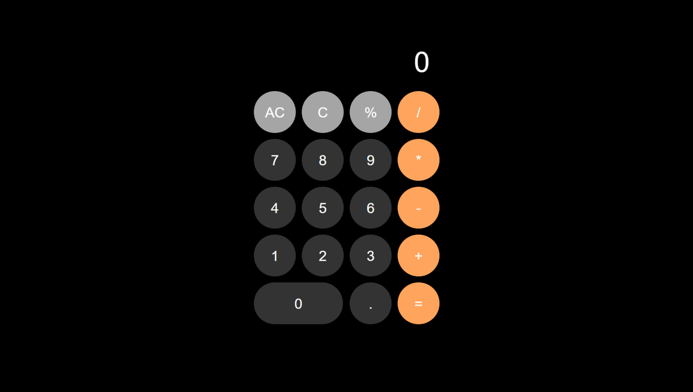

# Calculator App using JavaScript

A Calculator App built with HTML, CSS, and JavaScript which also has a dark mode.

Simple Calculator App . It includes: 

- [x] JavaScripts
- [x] ECMAScript 6+
- [x] JavaScript Math
- [x] Separate CSS stylesheets generation
- [x] Automatic HTML generation

## Starting the dev server

Make sure you have the latest version of ES6 installed.

1. `git clone https://github.com/am-abazari/Calculator`
2. Run `index.html`
3. Open [http://127.0.0.1:5500/index.html](http://127.0.0.1:5500/index.html)

## Code Coverage

The project is using the <strong>JavaScript Math</strong>. All configurations are located in `index.html`, inside the `body` object.

## About Author

<strong>Amirhossein Abazari</strong> Full-Stack Web Developer
